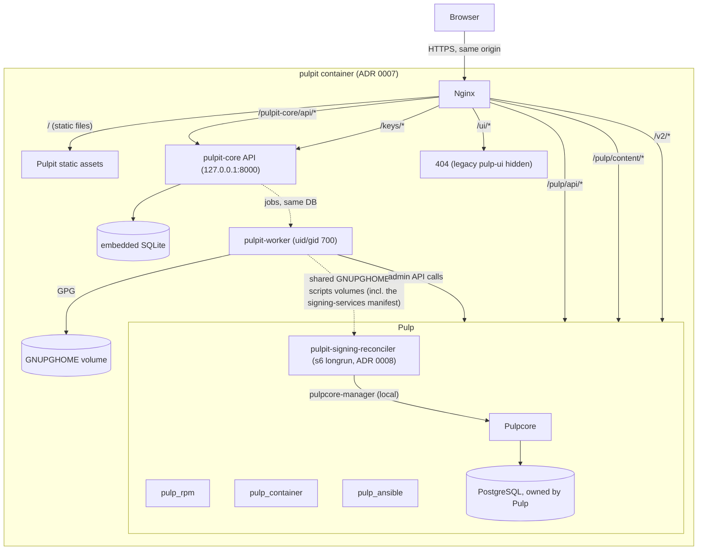

# Architecture

Pulpit's frontend is a static single-page application with no backend of its own — see ADR 0001.
As of ADR 0006, the wider Pulpit _project_ also includes pulpit-core/pulpit-worker, a
narrowly-scoped backend for capabilities Pulp's API and a browser cannot host between them —
signing key custody being the first. Since ADR 0007, nginx (serving that SPA) + pulpit-core (the
API) + pulpit-worker (the job queue) run as three OS processes inside one `pulpit`
container/image, not three separate ones - see that ADR for why and how the process-level
separation between them (the API never touches private key material) survives the merge. This
document explains the shape of the whole system and where responsibility lives; see
`docs/signing.md` for the signing module specifically.

## Topology



Everything in this diagram runs as containers in the Compose dev environment; in production
`pulp` is whatever Pulp deployment the operator already runs, and `pulpit` is deployed alongside
it, reached only via `PULP_UPSTREAM` (a plain `host:port`, deployment/docker/pulpit/entrypoint.sh) so Pulp
can be a sibling container, a Kubernetes Service, or a real remote host with no image change. See
ADR 0005, ADR 0006, ADR 0007, and `docs/DEPLOYMENT.md`.

## pulpit-core and pulpit-worker (ADR 0006, merged by ADR 0007)

- **pulpit-core** is a FastAPI service backed by an embedded SQLite database by default (still
  configurable to a real Postgres instead - `app/core/config/settings.py`). It exposes a
  versioned, authenticated module API (`/pulpit-core/api/v1/<module>/...`) plus any module's
  opted-in unauthenticated routes (signing's public key endpoint, `/keys/...`). It validates the
  caller's existing Pulp session the same way the frontend does (`GET /pulp/api/v3/login/`) — no
  separate identity store.
- **pulpit-worker** runs the same codebase's background job queue and the signing module's
  rotation-check scheduler, as a separate OS process (uid/gid 700) within the same `pulpit`
  container as pulpit-core - the only one with GPG key material's volume mounted. pulpit-core's
  API process never has that access, by construction (`docs/signing.md`, ADR 0007's own
  entrypoint design). It never reaches into the `pulp` container at all (ADR 0008): the one
  Pulp-side administrative command signing needs is instead automated by a small reconciler
  colocated _inside_ a derived Pulp image, reading a desired-state manifest off the volume already
  shared with `pulpit-worker` — opt-in (falls back to a manual command otherwise), and identical
  across Docker/Podman/Kubernetes for the first time (`docs/signing.md` "Automating the manual Pulp
  step", ADR 0008).
- Structure (`pulpit-core/app/`):
  ```
  app/
    api/            # health check, router aggregation
    core/
      config/       # settings (env-var driven, all signing identity defaults overridable)
      database/     # SQLAlchemy session/base
      events/       # in-process pub/sub + durable events_log table
      jobs/         # generic job queue (module-agnostic)
    adapters/
      pulp/         # the only place that constructs a Pulp request (mirrors src/api/client/)
    modules/
      signing/      # first module - see docs/signing.md
  worker/           # pulpit-worker's own process entrypoint (worker/main.py)
  migrations/       # Alembic
  ```
- A module owns its routes, models, jobs, and domain logic; it never reaches into another module's
  internals, and cross-module notification goes through the event bus, not direct calls — the
  seam a second module (validation, notifications, scheduled maintenance, ...) would use later
  without touching the signing module at all.

## Responsibilities

**Pulp** (unchanged, out of Pulpit's scope):

- All persistent state: repositories, repository versions, content, remotes, distributions,
  publications, tasks, users, groups, roles, permissions.
- All authentication and authorization decisions.
- All async work (sync, publish, import) via its task system.
- Its own PostgreSQL database — Pulpit never talks to a database directly.

**Pulpit**:

- Renders Pulp's data using PatternFly, in a navigation structure organized by product area
  (RPM / Containers / Ansible / Access / Administration — see `docs/UX.md`).
- Calls Pulp's REST API directly (relative, same-origin URLs only).
- Tracks async Pulp tasks and reflects their state (waiting/running/completed/failed/canceled) —
  see "Tasks" below and the `pulp-tasks` skill.
- Normalizes Pulp API errors into a consistent, distinguishable set of UI states (unauthenticated,
  forbidden, not found, validation, conflict, backend unavailable, task failure, network failure)
  — see `docs/PULP_API.md`.
- Detects which plugins/components are actually installed via the status endpoint and adapts the
  UI instead of assuming a fixed plugin set (see "Capability detection" below).
- Holds ephemeral, browser-local UI state only (filters, pagination, form drafts, TanStack Query
  cache).

## API client layer

```
src/api/
├── generated/          # openapi-typescript output, never hand-edited (ADR 0004)
│   ├── core/
│   ├── rpm/
│   ├── container/
│   └── ansible/
├── client/             # hand-written typed adapters + the fetch wrapper
├── errors/             # Pulp error -> normalized UI error shape
└── tasks/              # task href tracking / polling abstraction
```

Feature code (`src/features/<domain>/`) calls typed adapters in `src/api/client/`, wrapped in
TanStack Query hooks (ADR 0003). Nothing outside `src/api/` constructs a Pulp URL by hand.

## Authentication boundary

Pulpit never implements login, session storage, or RBAC itself — see `docs/AUTHENTICATION.md`
and `docs/RBAC.md`. It reacts to what Pulp's API tells it (401/403, current-user/permission
information where available) and lets the deployment's actual auth mechanism (Pulp native auth,
reverse-proxy auth, external SSO) do the work.

## Tasks as a first-class concept

Many Pulp operations (sync, publish, import) return a task href instead of completing inline.
Pulpit tracks these through a shared abstraction (`src/api/tasks`) rather than each feature
re-implementing polling:

```
mutation (e.g. "sync repository")
      |
      v
Pulp returns a task href
      |
      v
useTask(href) polls task status
      |
      +--> waiting / running -> reflected in the masthead task drawer
      +--> completed          -> invalidate affected TanStack Query keys
      +--> failed / canceled  -> surface failure detail, do not fake progress
```

Only fields Pulp's task API actually returns are shown (no fabricated progress percentages). See
the `pulp-tasks` skill.

## Capability detection

Not every Pulp deployment has every plugin installed. Pulpit derives a small capability map
(`src/api/capabilities.ts`) from the `/pulp/api/v3/status/` response's reported components (e.g.
`capabilities.rpm`, `capabilities.container`, `capabilities.ansible`), never hardcoded to `true`.
`AppNav` (`src/app/layout/AppNav.tsx`) uses it to hide a plugin's entire nav group when that
plugin isn't installed, instead of leaving a dead nav section whose every page would just 404 -
failing open (showing every group) while status is still loading or unavailable, so a transient
status problem never hides real navigation (docs/ROADMAP.md "API/version-compatibility
handling").

## Build/runtime architecture

- **Build time**: Node.js + Vite compiles TypeScript/React/PatternFly into static assets
  (`dist/`), and pulpit-core's own Python package is installed - see the `Dockerfile`. This is
  the only place Node.js runs; it's never part of the runtime image.
- **Runtime**: `deployment/docker/pulpit/entrypoint.sh` starts nginx (serving those static assets and
  reverse-proxying Pulp's API/content/registry paths on the same origin), pulpit-core (uvicorn,
  as the unprivileged `pulpit` user), and the pulpit-worker job-queue loop (as uid/gid 700) as
  three separate processes in the same container - see ADR 0007.

## Process-level isolation inside the `pulpit` container (ADR 0007)

Worth stating plainly since it's easy to accidentally erode: even though nginx, pulpit-core, and
pulpit-worker now share one container/image, they remain three separate OS processes with
different Unix identities, and this boundary is deliberate, not incidental:

- pulpit-core (the API, reachable from the browser via nginx) runs as the unprivileged `pulpit`
  user and has **no** access to GNUPGHOME - the volume simply isn't mounted for it to read even
  if it wanted to, by construction (`docs/signing.md`). Only pulpit-worker (uid/gid 700) has that
  access.
- pulpit-core's own database is embedded SQLite (`/var/lib/pulpit`, a dedicated volume) - never
  Pulp's own data, which remains entirely Pulp's (its own PostgreSQL, never touched by Pulpit
  directly).
- `compose.yml`'s `redis` service is unrelated to any of this: it's Pulp's own optional HTTP
  response cache (`PULP_CACHE_ENABLED` on the `pulp` service — see `docs/DEPLOYMENT.md` "Redis"),
  configured and consumed entirely by pulpcore. Nothing in the `pulpit` container talks to it
  directly.
